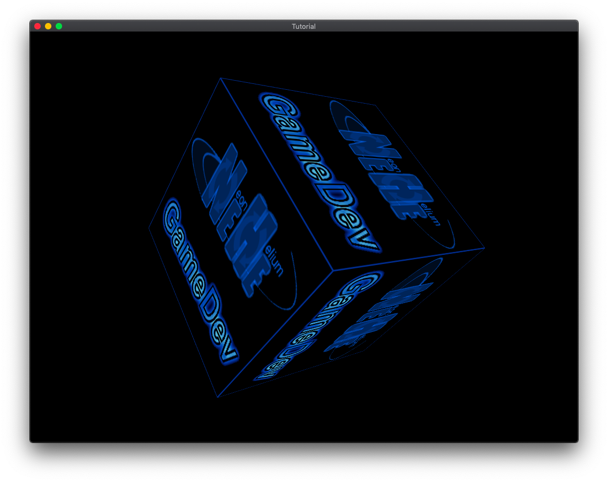

# zigNeHe

The ancient NeHe OpenGL tutorials, ported to the Zig language.

Based largely on the C-based glfw 2 NeHe tutorials by Joseph Redmon (pjreddie@) https://github.com/pjreddie/NeHe-Tutorials-Using-GLFW with updates for glfw 3. Other useful base material from https://github.com/andrewrk/tetris.

The build.zig files work on some versions of MacOS and FreeBSD. With a little effort they should build on other OSes - contributions welcome.


## Requirements

Tested with Zig version 0.7.1.

You will need to install glfw (see https://www.glfw.org/). On MacOS:

```
$ brew install glfw
```

On MacOS, you will also need to install XCode in order to get the OpenGL framework.


## Building and running

In each LessonXX directory, you can build and run the given tutorial by running:

```
$ zig build run
```

On MacOS, you may run into linking problems with OpenGL. If this happens try:

```
$ ZIG_SYSTEM_LINKER_HACK=1 zig build run
```

## Screenshot

From Lesson 6:




## TODO

* Should do error-handling in a more Zig-like way, and actually deal with gl initialization failing.
* All the lessons.
